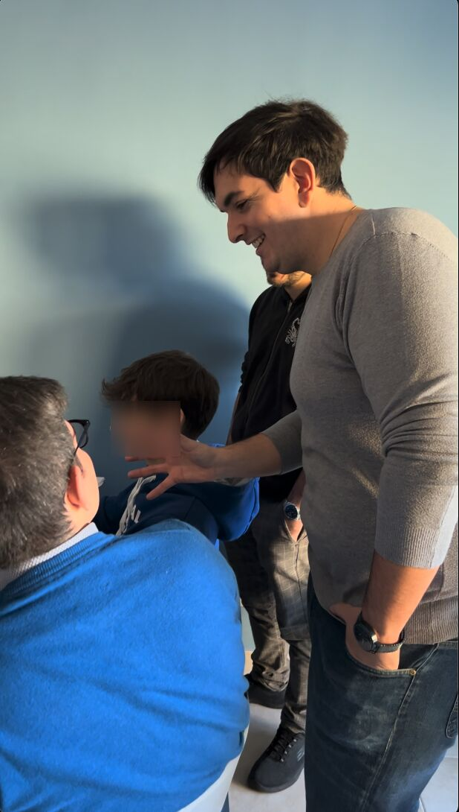

# I Taught GIT to High School Students

This blog post is not about a new technology or an hot tech trend that you would hear of nowadays, it's about my experience as **Mentor** for High School students.

